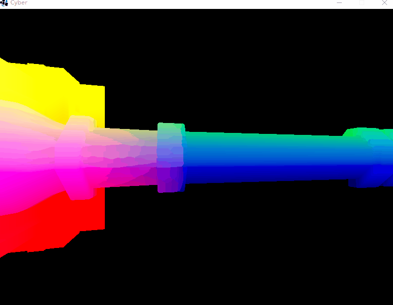
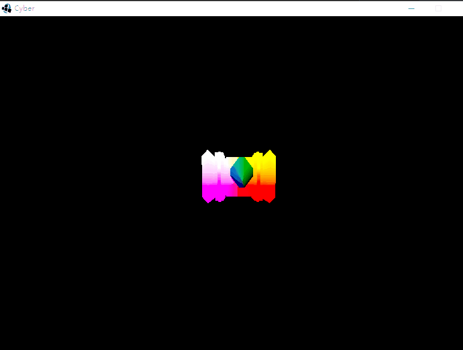
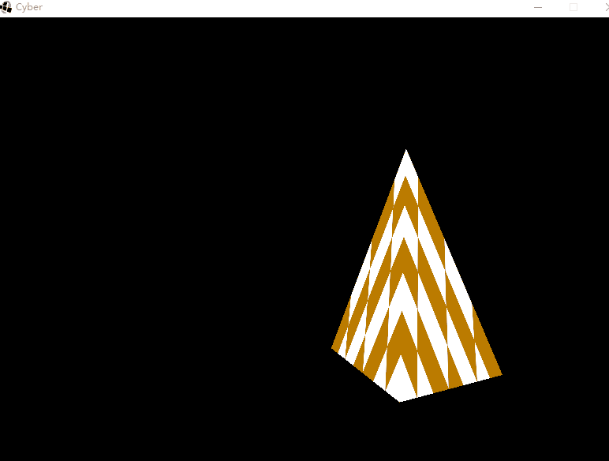
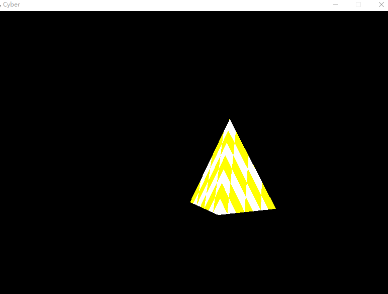

# GameEngine Java 3D V2.0

**抬头望天，璀璨的星海，承载着整个宇宙的过往。这个世界发生的一切也曾闪耀其中。
终将逝去的你我，一定会再次相遇在这片星海之下。我们相视一笑，道一声：“我也曾来过”**

## 效果演示:

色调变化：

平移变换：

旋转变换：

缩放变换：

三棱锥：

透视变换：

摄像机移动：

纹理贴图:

环境光：

## 文档 版本二 V2.0

#### 引擎基本部分

[1.新建项目](./doc/基本架构/1.新建项目.md)

[2.新建时间实体类](./doc/基本架构/2.新建时间实体类.md)

[3.新建窗体类](./doc/基本架构/3.新建窗体类.md)

[4.新建入口类](./doc/基本架构/4.新建入口类.md)

[5.新建游戏类](./doc/基本架构/5.新建游戏类.md)

[6.完善入口类](./doc/基本架构/6.完善入口类.md)

[7.新建输入类](./doc/基本架构/7.新建输入类.md)

[8.新建二维向量](./doc/基本架构/8.新建二维向量.md)

[9.新建三维向量](./doc/基本架构/9.新建三维向量.md)

[10.新建四元数](./doc/基本架构/10.新建四元数.md)

[11.新建四维矩阵](./doc/基本架构/11.新建四维矩阵.md)

[24.透视变换](./doc/基本架构/24.透视变换.md)

[25.新建摄像机类](./doc/基本架构/25.新建摄像机类.md)

[29.为摄像机加入方向变化](./doc/基本架构/29.为摄像机加入方向变化.md)

[30.加入环境光](./doc/基本架构/30.加入环境光)

#### 渲染器部分

[12.新建定点类](./doc/渲染器/12.新建定点类.md)

[13.新建网格类](./doc/渲染器/13.新建网格类.md)

[14.第一个平面](./doc/渲染器/14.第一个平面.md)

[16.新建着色器](./doc/渲染器/16.新建着色器.md)

[17.为我们的第一个平面渲染材质](./doc/渲染器/17.为我们的第一个平面渲染材质.md)

[18.均匀化平面变换色调](./doc/渲染器/18.均匀化平面变换色调.md)

[22.从2d到3d](./doc/渲染器/22.从2d到3d.md)

[28.新建纹理类](./doc/渲染器/28.新建纹理类.md)

#### 文件系统部分

[15.资源管理器](./doc/文件系统/15.资源管理器.md)

[23.obj文件资源管理器](./doc/文件系统/23.obj文件资源管理器.md)

[27.贴图加载器.md](./doc/文件系统/27.贴图加载器.md)

#### 声音系统部分

#### 物理引擎部分

[19.添加平移变换](./doc/物理引擎/19.添加平移变换.md)

[20.添加旋转变换](./doc/物理引擎/20.添加旋转变换.md)

[21.添加缩放变换](./doc/物理引擎/21.添加缩放变换.md)

#### 网络请求部分

（未完待续...）

代码见：GameEngine3dV2 使用IDEA 编写

## 版本一 V1.0

文档见：[doc-v1.0](./版本一.md)

代码见：3DGameEngine 使用eclipse编写

### 参考资料：

《游戏引擎架构》 