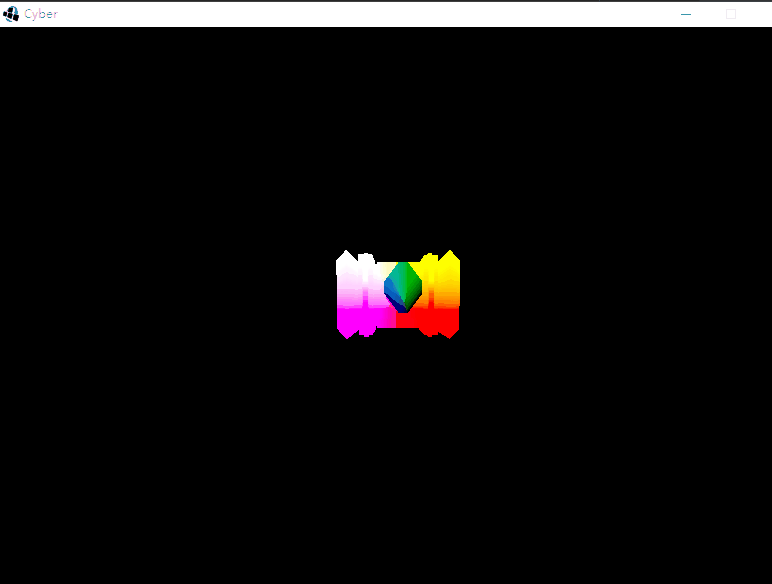

## GameEngine Java 3D V2.0

### 25.新建摄像机类

摄像机的一些基本操作

```java
public class Camera {

    public static final Vector3f yAxis = new Vector3f(0, 1, 0);
    
    /*
    * 坐标的三个方向
    * */
    private Vector3f pos;
    private Vector3f forward;
    private Vector3f up;

    /*
    * 构造函数
    * */
    public Camera()
    {
        this(new Vector3f(0,0,0), new Vector3f(0,0,1), new Vector3f(0,1,0));
    }
    public Camera(Vector3f pos, Vector3f forward, Vector3f up)
    {
        this.pos = pos;
        this.forward = forward;
        this.up = up;

        up.normalize();
        forward.normalize();
    }
    
    /*
    * 输入
    * */
    public void input()
    {
        float movAmt = (float)(10 * Time.getDelta());
        float rotAmt = (float)(100 * Time.getDelta());

        if(Input.getKey(Input.KEY_W))
            move(getForward(), movAmt);
        if(Input.getKey(Input.KEY_S))
            move(getForward(), -movAmt);
        if(Input.getKey(Input.KEY_A))
            move(getLeft(), movAmt);
        if(Input.getKey(Input.KEY_D))
            move(getRight(), movAmt);

        if(Input.getKey(Input.KEY_UP))
            rotateX(-rotAmt);
        if(Input.getKey(Input.KEY_DOWN))
            rotateX(rotAmt);
        if(Input.getKey(Input.KEY_LEFT))
            rotateY(-rotAmt);
        if(Input.getKey(Input.KEY_RIGHT))
            rotateY(rotAmt);
    }
    
    /*
    * 移动 方向 加 速度
    * */
    public void move(Vector3f dir, float amt)
    {
        pos = pos.add(dir.mul(amt));
    }
    public void rotateY(float angle)
    {
        Vector3f Haxis = yAxis.cross(forward);
        Haxis.normalize();

        forward.rotate(angle, yAxis);
        forward.normalize();

        up = forward.cross(Haxis);
        up.normalize();
    }
    /*
    * 绕X轴旋转
    * */
    public void rotateX(float angle)
    {
        Vector3f Haxis = yAxis.cross(forward);
        Haxis.normalize();

        forward.rotate(angle, Haxis);
        forward.normalize();

        up = forward.cross(Haxis);
        up.normalize();
    }

    /*
    * 获得左边的方向
    * */
    public Vector3f getLeft()
    {
        Vector3f left = forward.cross(up);
        left.normalize();
        return left;
    }
    /*
    * 获得右边的方向
    * */
    public Vector3f getRight()
    {
        Vector3f right = up.cross(forward);
        right.normalize();
        return right;
    }
    /*
    * 当前摄像机的位置
    * */
    public Vector3f getPos() {
        return pos;
    }
    public void setPos(Vector3f pos) {
        this.pos = pos;
    }
    public Vector3f getForward() {
        return forward;
    }
    public void setForward(Vector3f forward) {
        this.forward = forward;
    }
    public Vector3f getUp() {
        return up;
    }
    public void setUp(Vector3f up) {
        this.up = up;
    }


}


```

在游戏类里设置并调用即可

```java
        /*
        * 初始化摄像机
        * */
        camera = new Camera();
        Transform.setCamera(camera);

```

```java

camera.input();

```

效果如下：

