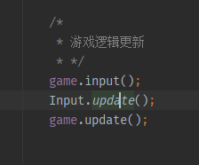
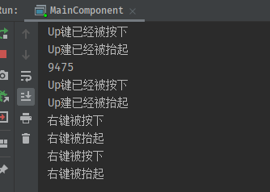

## GameEngine Java 3D V2.0

### 7.新建输入类

首先定义按键的数量与鼠标的控制数量

并且建好抬起 按下 正在按下三种状态的键盘与鼠标队列

```java

public class Input {
    /*
    * 键盘与鼠标的状态数
    * */
    public static final int NUM_KEYCODES = 256;
    public static final int NUM_MOUSEBUTTONS = 5;

    /*
    * 当前 键盘按下 当前键盘值 键盘抬起的值
    * */
    private static ArrayList<Integer> currentKeys = new ArrayList<Integer>();
    private static ArrayList<Integer> downKeys = new ArrayList<Integer>();
    private static ArrayList<Integer> upKeys = new ArrayList<Integer>();
    /*
     * 当前 鼠标按下 当前鼠标值 鼠标抬起的值
     * */
    private static ArrayList<Integer> currentMouse = new ArrayList<Integer>();
    private static ArrayList<Integer> downMouse = new ArrayList<Integer>();
    private static ArrayList<Integer> upMouse = new ArrayList<Integer>();
}

```

定义键盘按下时 判断是否抬起 与 按下键盘的方法 

```java

    /*
    * 获取键盘传来的key值
    * */
    public static boolean getKey(int keyCode){
        return Keyboard.isKeyDown(keyCode);
    }
    /*
    * 获取按下键盘获得的值
    * */
    public static boolean getKeyDown(int keyCode){
        return downKeys.contains(keyCode);
    }
    /*
    * 获取抬起键盘获得的值
    * */
    public static boolean getKeyUp(int keyCode){
        return upKeys.contains(keyCode);
    }

```

鼠标同理

```java

    /*
    * 鼠标事件同理
    * */
    public static boolean getMouse(int mouseButton) {
        return Mouse.isButtonDown(mouseButton);
    }

    public static boolean getMouseDown(int mouseButton) {
        return downMouse.contains(mouseButton);
    }

    public static boolean getMouseUp(int mouseButton) {
        return upMouse.contains(mouseButton);
    }

```

再编写更新事件 对鼠标与键盘进行更新

```java

/*
    * 更新事件
    * */
    public static void update() {
        //是否正在按下鼠标 是则压入队列
        currentMouse.clear();
        for(int i = 0; i < NUM_MOUSEBUTTONS;i++){
            if(getMouse(i)){
                currentMouse.add(i);
            }
        }
        //是否按下鼠标 是则压入队列
        downMouse.clear();
        for (int i = 0;i<NUM_MOUSEBUTTONS;i++){
            if (getMouse(i) && !currentMouse.contains(i)){
                downMouse.add(i);
            }
        }
        //是否已经抬起鼠标 是则压入队列
        upMouse.clear();
        for (int i=0;i<NUM_MOUSEBUTTONS;i++){
            if(!getMouse(i) && currentMouse.contains(i)){
                upMouse.add(i);
            }
        }
        //键盘功能同理
        upKeys.clear();

        for(int i = 0; i < NUM_KEYCODES; i++)
            if(!getKey(i) && currentKeys.contains(i))
                upKeys.add(i);

        downKeys.clear();

        for(int i = 0; i < NUM_KEYCODES; i++)
            if(getKey(i) && !currentKeys.contains(i))
                downKeys.add(i);

        currentKeys.clear();

        for(int i = 0; i < NUM_KEYCODES; i++)
            if(getKey(i))
                currentKeys.add(i);


    }

```

既然我们已经建好了Input类 那么就可以为
Game的接口里加入input
```java
public interface CyberGame {

    /*
     * 开始
     * */

    void start();

    /*
     * 更新
     * */
    void update();

    /*
     * 渲染
     * */
    void render();

    /*
    * 输入
    * */
    void input();

}


```

在类里写入测试


```java


    /*
    * 输入事件
    * */

    public void input(){
        if(Input.getKeyDown(Keyboard.KEY_UP))
            System.out.println("Up键已经被按下");
        if (Input.getKeyUp(Keyboard.KEY_UP)){
            System.out.println("Up建已经被抬起");
        }
        if(Input.getMouseDown(1)) {
            System.out.println("右键被按下");
        }
        if(Input.getMouseUp(1)){
            System.out.println("右键被抬起");
        }
    }

```
在入口类更新逻辑




结果：




### 后面可以换成这样

```java


public class Input {
    /*
    * 键盘与鼠标的状态数
    * */
    public static final int NUM_KEYCODES = 256;
    public static final int NUM_MOUSEBUTTONS = 5;

    /*
    * 上次的按键与鼠标
    * */
    private static ArrayList<Integer> lastKeys = new ArrayList<Integer>();
    private static ArrayList<Integer> lastMouse = new ArrayList<Integer>();


    public static void update(){
        lastKeys.clear();

        for(int i = 0; i < NUM_KEYCODES; i++)
            if(getKey(i))
                lastKeys.add(i);

        lastMouse.clear();

        for(int i = 0; i < NUM_MOUSEBUTTONS; i++)
            if(getMouse(i))
                lastMouse.add(i);
    }
    /*
    * 创建键盘与鼠标的抬起与按下的判断
    * */
    public static boolean getKey(int keyCode)
    {
        return Keyboard.isKeyDown(keyCode);
    }

    public static boolean getKeyDown(int keyCode)
    {
        return getKey(keyCode) && !lastKeys.contains(keyCode);
    }

    public static boolean getKeyUp(int keyCode)
    {
        return !getKey(keyCode) && lastKeys.contains(keyCode);
    }

    public static boolean getMouse(int mouseButton)
    {
        return Mouse.isButtonDown(mouseButton);
    }

    public static boolean getMouseDown(int mouseButton)
    {
        return getMouse(mouseButton) && !lastMouse.contains(mouseButton);
    }

    public static boolean getMouseUp(int mouseButton)
    {
        return !getMouse(mouseButton) && lastMouse.contains(mouseButton);
    }
    /*
    * 获取鼠标当前位置
    * */
    public static Vector2f getMousePosition()
    {
        return new Vector2f(Mouse.getX(), Mouse.getY());
    }


}

```


之后将一些常用的Input常量写入

```java
    public static final int KEY_NONE            = 0x00;
    public static final int KEY_ESCAPE          = 0x01;
    public static final int KEY_1               = 0x02;
    public static final int KEY_2               = 0x03;
    public static final int KEY_3               = 0x04;
    public static final int KEY_4               = 0x05;
    public static final int KEY_5               = 0x06;
    public static final int KEY_6               = 0x07;
    public static final int KEY_7               = 0x08;
    public static final int KEY_8               = 0x09;
    public static final int KEY_9               = 0x0A;
    public static final int KEY_0               = 0x0B;
    public static final int KEY_MINUS           = 0x0C; /* - on main keyboard */
    public static final int KEY_EQUALS          = 0x0D;
    public static final int KEY_BACK            = 0x0E; /* backspace */
    public static final int KEY_TAB             = 0x0F;
    public static final int KEY_Q               = 0x10;
    public static final int KEY_W               = 0x11;
    public static final int KEY_E               = 0x12;
    public static final int KEY_R               = 0x13;
    public static final int KEY_T               = 0x14;
    public static final int KEY_Y               = 0x15;
    public static final int KEY_U               = 0x16;
    public static final int KEY_I               = 0x17;
    public static final int KEY_O               = 0x18;
    public static final int KEY_P               = 0x19;
    public static final int KEY_LBRACKET        = 0x1A;
    public static final int KEY_RBRACKET        = 0x1B;
    public static final int KEY_RETURN          = 0x1C; /* Enter on main keyboard */
    public static final int KEY_LCONTROL        = 0x1D;
    public static final int KEY_A               = 0x1E;
    public static final int KEY_S               = 0x1F;
    public static final int KEY_D               = 0x20;
    public static final int KEY_F               = 0x21;
    public static final int KEY_G               = 0x22;
    public static final int KEY_H               = 0x23;
    public static final int KEY_J               = 0x24;
    public static final int KEY_K               = 0x25;
    public static final int KEY_L               = 0x26;
    public static final int KEY_SEMICOLON       = 0x27;
    public static final int KEY_APOSTROPHE      = 0x28;
    public static final int KEY_GRAVE           = 0x29; /* accent grave */
    public static final int KEY_LSHIFT          = 0x2A;
    public static final int KEY_BACKSLASH       = 0x2B;
    public static final int KEY_Z               = 0x2C;
    public static final int KEY_X               = 0x2D;
    public static final int KEY_C               = 0x2E;
    public static final int KEY_V               = 0x2F;
    public static final int KEY_B               = 0x30;
    public static final int KEY_N               = 0x31;
    public static final int KEY_M               = 0x32;
    public static final int KEY_COMMA           = 0x33;
    public static final int KEY_PERIOD          = 0x34; /* . on main keyboard */
    public static final int KEY_SLASH           = 0x35; /* / on main keyboard */
    public static final int KEY_RSHIFT          = 0x36;
    public static final int KEY_MULTIPLY        = 0x37; /* * on numeric keypad */
    public static final int KEY_LMENU           = 0x38; /* left Alt */
    public static final int KEY_LALT            = KEY_LMENU; /* left Alt */
    public static final int KEY_SPACE           = 0x39;
    public static final int KEY_CAPITAL         = 0x3A;
    public static final int KEY_F1              = 0x3B;
    public static final int KEY_F2              = 0x3C;
    public static final int KEY_F3              = 0x3D;
    public static final int KEY_F4              = 0x3E;
    public static final int KEY_F5              = 0x3F;
    public static final int KEY_F6              = 0x40;
    public static final int KEY_F7              = 0x41;
    public static final int KEY_F8              = 0x42;
    public static final int KEY_F9              = 0x43;
    public static final int KEY_F10             = 0x44;
    public static final int KEY_NUMLOCK         = 0x45;
    public static final int KEY_SCROLL          = 0x46; /* Scroll Lock */
    public static final int KEY_NUMPAD7         = 0x47;
    public static final int KEY_NUMPAD8         = 0x48;
    public static final int KEY_NUMPAD9         = 0x49;
    public static final int KEY_SUBTRACT        = 0x4A; /* - on numeric keypad */
    public static final int KEY_NUMPAD4         = 0x4B;
    public static final int KEY_NUMPAD5         = 0x4C;
    public static final int KEY_NUMPAD6         = 0x4D;
    public static final int KEY_ADD             = 0x4E; /* + on numeric keypad */
    public static final int KEY_NUMPAD1         = 0x4F;
    public static final int KEY_NUMPAD2         = 0x50;
    public static final int KEY_NUMPAD3         = 0x51;
    public static final int KEY_NUMPAD0         = 0x52;
    public static final int KEY_DECIMAL         = 0x53; /* . on numeric keypad */
    public static final int KEY_F11             = 0x57;
    public static final int KEY_F12             = 0x58;
    public static final int KEY_F13             = 0x64; /*                     (NEC PC98) */
    public static final int KEY_F14             = 0x65; /*                     (NEC PC98) */
    public static final int KEY_F15             = 0x66; /*                     (NEC PC98) */
    public static final int KEY_KANA            = 0x70; /* (Japanese keyboard)            */
    public static final int KEY_CONVERT         = 0x79; /* (Japanese keyboard)            */
    public static final int KEY_NOCONVERT       = 0x7B; /* (Japanese keyboard)            */
    public static final int KEY_YEN             = 0x7D; /* (Japanese keyboard)            */
    public static final int KEY_NUMPADEQUALS    = 0x8D; /* = on numeric keypad (NEC PC98) */
    public static final int KEY_CIRCUMFLEX      = 0x90; /* (Japanese keyboard)            */
    public static final int KEY_AT              = 0x91; /*                     (NEC PC98) */
    public static final int KEY_COLON           = 0x92; /*                     (NEC PC98) */
    public static final int KEY_UNDERLINE       = 0x93; /*                     (NEC PC98) */
    public static final int KEY_KANJI           = 0x94; /* (Japanese keyboard)            */
    public static final int KEY_STOP            = 0x95; /*                     (NEC PC98) */
    public static final int KEY_AX              = 0x96; /*                     (Japan AX) */
    public static final int KEY_UNLABELED       = 0x97; /*                        (J3100) */
    public static final int KEY_NUMPADENTER     = 0x9C; /* Enter on numeric keypad */
    public static final int KEY_RCONTROL        = 0x9D;
    public static final int KEY_NUMPADCOMMA     = 0xB3; /* , on numeric keypad (NEC PC98) */
    public static final int KEY_DIVIDE          = 0xB5; /* / on numeric keypad */
    public static final int KEY_SYSRQ           = 0xB7;
    public static final int KEY_RMENU           = 0xB8; /* right Alt */
    public static final int KEY_RALT            = KEY_RMENU; /* right Alt */
    public static final int KEY_PAUSE           = 0xC5; /* Pause */
    public static final int KEY_HOME            = 0xC7; /* Home on arrow keypad */
    public static final int KEY_UP              = 0xC8; /* UpArrow on arrow keypad */
    public static final int KEY_PRIOR           = 0xC9; /* PgUp on arrow keypad */
    public static final int KEY_LEFT            = 0xCB; /* LeftArrow on arrow keypad */
    public static final int KEY_RIGHT           = 0xCD; /* RightArrow on arrow keypad */
    public static final int KEY_END             = 0xCF; /* End on arrow keypad */
    public static final int KEY_DOWN            = 0xD0; /* DownArrow on arrow keypad */
    public static final int KEY_NEXT            = 0xD1; /* PgDn on arrow keypad */
    public static final int KEY_INSERT          = 0xD2; /* Insert on arrow keypad */
    public static final int KEY_DELETE          = 0xD3; /* Delete on arrow keypad */
    public static final int KEY_LMETA           = 0xDB; /* Left Windows/Option key */
    public static final int KEY_LWIN            = KEY_LMETA; /* Left Windows key */
    public static final int KEY_RMETA           = 0xDC; /* Right Windows/Option key */
    public static final int KEY_RWIN            = KEY_RMETA; /* Right Windows key */
    public static final int KEY_APPS            = 0xDD; /* AppMenu key */
    public static final int KEY_POWER           = 0xDE;
    public static final int KEY_SLEEP           = 0xDF;

```
