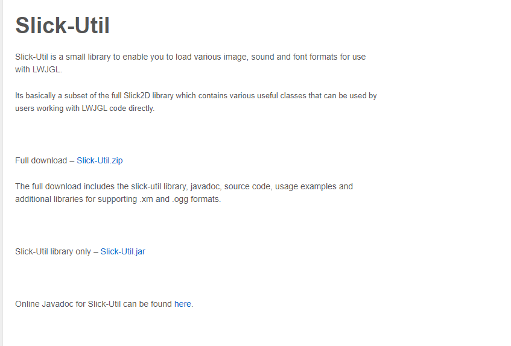

## GameEngine Java 3D V2.0

### 26.贴图加载器

这里加载贴图我们用到了一个第三方库 便于我们对贴图 音源文件等资源的读取加载



在pom.xml导入新的库

```xml
        <!-- 方便音源与贴图加载的工具-->
        <dependency>
            <groupId>slick-util</groupId>
            <artifactId>slick-util</artifactId>
            <version>1.0.0</version>
        </dependency>
```


加载贴图的方法

```java
	public static Texture loadTexture(String fileName)
 	{
 		String[] splitArray = fileName.split("\\.");
 		String ext = splitArray[splitArray.length - 1];
 		
 		try
 		{		
 			int id = TextureLoader.getTexture(ext, new FileInputStream(new File("./res/textures/" + fileName))).getTextureID();
 			
 			return new Texture(id);
 		}
 		catch(Exception e)
 		{
 			e.printStackTrace();
 			System.exit(1);
 		}
 		
 		return null;
 	}

```

结果如下:
