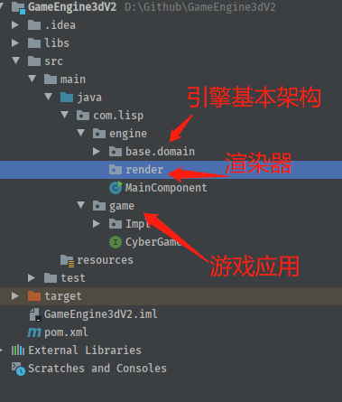

## GameEngine Java 3D V2.0

### 12.新建顶点类 Vertex

> 为什么要使用顶点类?   
> 在电脑图形学中，一般的三维模型通常可以通过曲面细分将非三角形曲面转换为三角形数组。而三维模型通常是透过在图元上依据顶点性质内插出数据以渲染出最后的立体。

相关阅读：

[维基百科：顶点](https://zh.wikipedia.org/wiki/%E9%A0%82%E9%BB%9E_(%E9%9B%BB%E8%85%A6%E5%9C%96%E5%AD%B8))

目前项目结构：




```java
public class Vertex {
    public static final int SIZE = 3;

    private Vector3f pos;

    public Vertex(Vector3f pos) {
        this.pos = pos;
    }

    public Vector3f getPos() {
        return pos;
    }

    public void setPos(Vector3f pos) {
        this.pos = pos;
    }
}

```
