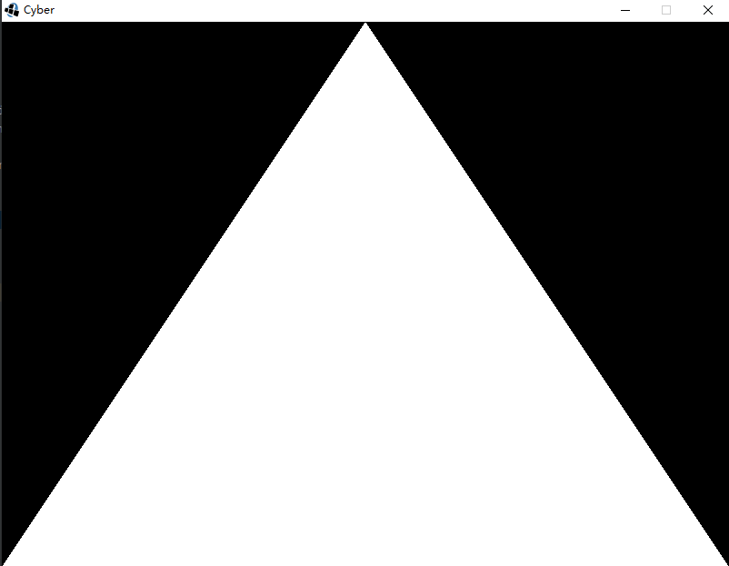

## GameEngine Java 3D V2.0

### 14.第一个平面

经过前面的铺垫 我们终于可以来使用我们的引擎做第一个平面了

```java

public class Game implements CyberGame {


    private Mesh mesh;
    /*
     * 构造函数
     * */

    public Game() {
        //新建网格类
        mesh = new Mesh();
        //添加点
        Vertex[] data = new Vertex[] { new Vertex(new Vector3f(-1, -1, 0)), new Vertex(new Vector3f(0, 1, 0)),
                new Vertex(new Vector3f(1, -1, 0)) };

        mesh.addVertices(data);

    }

    /*
     * 开始
     * */
    public void start() {
    }

    /*
    * 输入事件
    * */

    public void input(){
        if(Input.getKeyDown(Input.KEY_UP))
            System.out.println("Up键已经被按下");
        if (Input.getKeyUp(Input.KEY_UP)){
            System.out.println("Up建已经被抬起");
        }
        if(Input.getMouseDown(1)) {
            System.out.println("右键被按下");
        }
        if(Input.getMouseUp(1)){
            System.out.println("右键被抬起");
        }
    }


    /*
     * 更新
     * */
    public void update() {

    }

    /*
     * 渲染
     * */
    public void render() {
        mesh.draw();

    }

}

```

结果如下：
