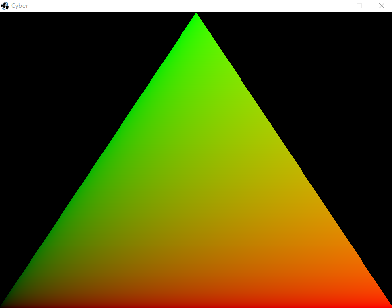

## GameEngine Java 3D V2.0

### 17.为我们的第一个平面渲染材质

在写完了着色器以后，我们就可以为我们之前写的第一个平面渲染上材质。
再此之前需要了解一下GLSL

>小提示：什么是GLSL?

GLSL - OpenGL Shading Language 也称作 GLslang，是一个以C语言为基础的高阶着色语言。它是由 OpenGL ARB 所建立，提供开发者对绘图管线更多的直接控制

相关阅读：
[GLSL](https://zh.wikipedia.org/wiki/GLSL)

在我们的资源文件夹里，写一个片段着色器与顶点着色器.

以fs后缀结尾的片段着色器
``` c
 #version 330

 in vec4 color;

 out vec4 fragColor;

 void main()
 {
     fragColor = color;
 } 
```

以vs后缀结尾的顶点着色器

```c
#version 330

 layout (location = 0) in vec3 position;

 out vec4 color;

 void main()
 {
     color = vec4(clamp(position, 0.0, 1.0), 1.0);
     gl_Position = vec4(position, 1.0);
 } 

```
在游戏类里加入着色器

```java
public class Game implements CyberGame {


    private Mesh mesh;
    private Shader shader;
    /*
     * 构造函数
     * */

    public Game() {
        //新建网格类
        mesh = new Mesh();
        shader = new Shader();
        //添加点
        Vertex[] data = new Vertex[] { new Vertex(new Vector3f(-1, -1, 0)), new Vertex(new Vector3f(0, 1, 0)),
                new Vertex(new Vector3f(1, -1, 0)) };

        mesh.addVertices(data);

        /*
        * 为网格类加上材质
        * */

        shader.addVertexShader(ResourceLoader.loadShader("basicVertex.vs"));
        shader.addFragmentShader(ResourceLoader.loadShader("basicFragment.fs"));
        shader.compileShader();

    }
    //剩下部分略过...

```

这样我们的第一个平面就被加载出来了:

