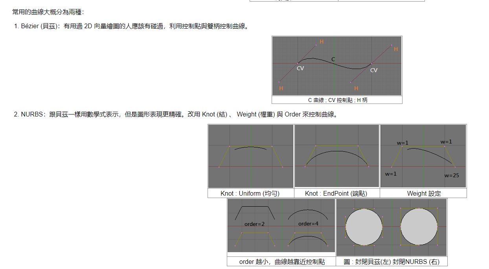

## GameEngine Java 3D V2.0

### 18.平面变换色调

在变化色调前我们需要为shader着色器加入Uniform操作

> 小提示：什么是Uniform?

如果改变原来模型的拓扑结构（即：增加或减少模型的边、顶点、面操作后），就等于改变原模型上节点参数分布。改变后的模型可能出现一些边线扭曲、挤压的现象，这会影响到曲面的品质，所以要对模型进行均匀化操作，这就是提及的“曲面在节点处的 参数值 “分布”均匀”的意思，也就是Uniform所起到的作用。



在shader里加入：

```java
//...

    /*
    * 均匀化
    * */
    public void addUniform(String uniform)
    {
        int uniformLocation = glGetUniformLocation(program, uniform);

        if(uniformLocation == 0xFFFFFFFF)
        {
            System.err.println("Error: 无法找到uniform " + uniform);
            new Exception().printStackTrace();
            System.exit(1);
        }

        uniforms.put(uniform, uniformLocation);
    }

    //...

    /*
    * 设置Uniform
    * */
    public void setUniformi(String uniformName, int value)
    {
        glUniform1i(uniforms.get(uniformName), value);
    }

    public void setUniformf(String uniformName, float value)
    {
        glUniform1f(uniforms.get(uniformName), value);
    }

    public void setUniform(String uniformName, Vector3f value)
    {
        glUniform3f(uniforms.get(uniformName), value.getX(), value.getY(), value.getZ());
    }

    public void setUniform(String uniformName, Matrix4f value)
    {
        glUniformMatrix4(uniforms.get(uniformName), true, Util.createFlippedBuffer(value));
    }   


```

在Util里加入缓存4维矩阵的方法：

```java
    /*
    * 缓存4维矩阵
    * */
    public static FloatBuffer createFlippedBuffer(Matrix4f value)
    {
        FloatBuffer buffer = createFloatBuffer(4 * 4);

        for(int i = 0; i < 4; i++)
            for(int j = 0; j < 4; j++)
                buffer.put(value.get(i, j));

        buffer.flip();

        return buffer;
    }

```

在Game类里加入均匀处理的方法

```java
        /*
        * 添加均匀的处理方法
        * */
        shader.addUniform("uniformFloat");

```
```java
    float temp = 0.0f;
    /*
     * 更新
     * */
    public void update() {
        temp += Time.getDelta();

        shader.setUniformf("uniformFloat", (float)Math.abs(Math.sin(temp)));
    }
```

添加uniform的着色器资源


在Game类里改变着色器读取的文件

```java
        /*
        * 为网格类加上材质
        * */

        shader.addVertexShader(ResourceLoader.loadShader("UniformVertex.vs"));
        shader.addFragmentShader(ResourceLoader.loadShader("UniformFragment.fs"));
        shader.compileShader();

```

结果如下:

