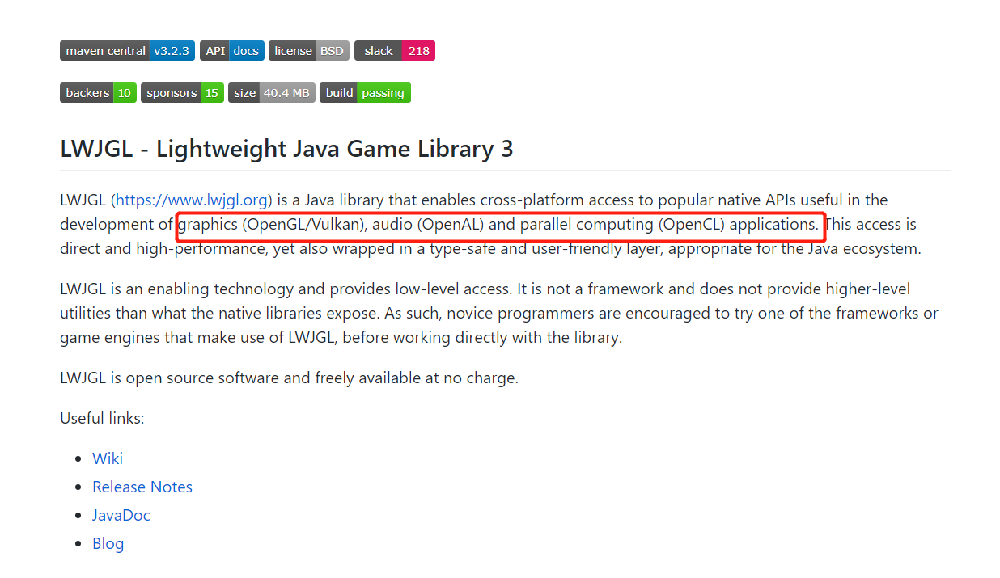
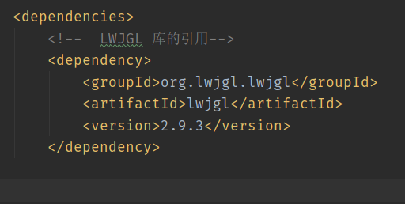
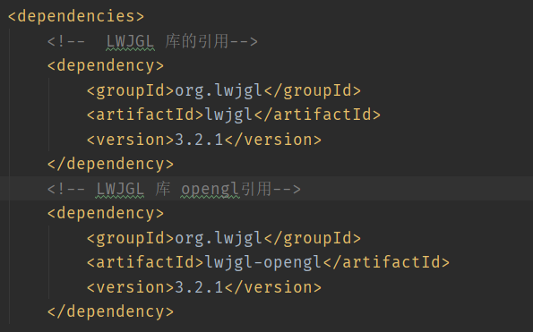
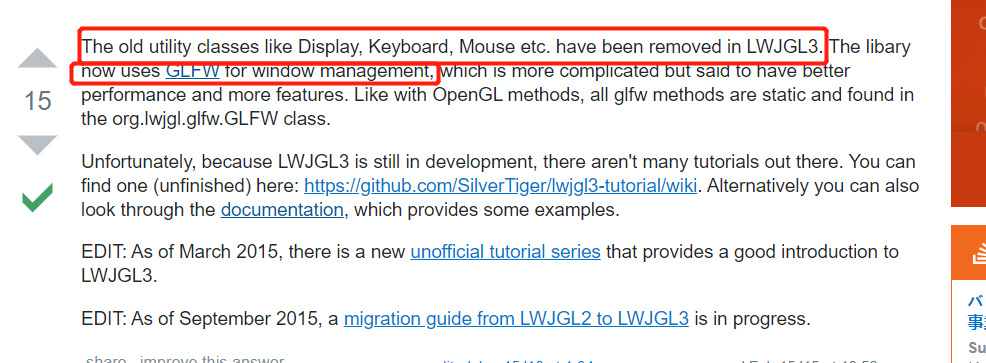
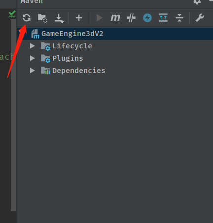
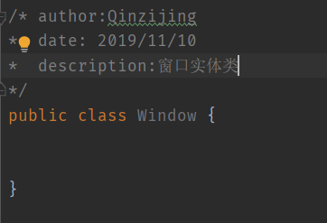
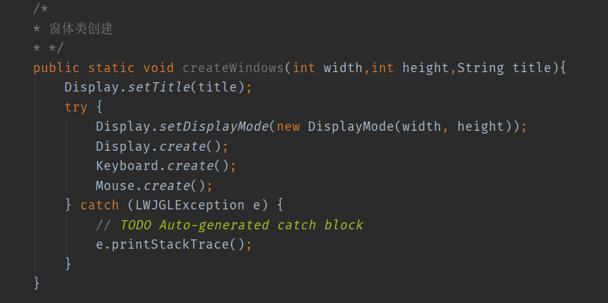
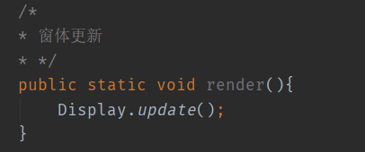
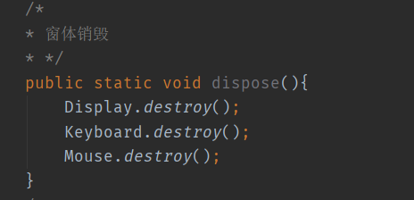
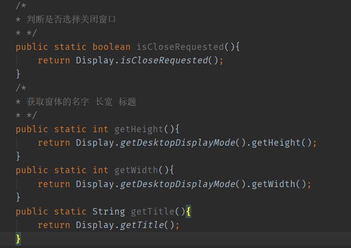

## GameEngine Java 3D V2.0

### 3.新建窗体类
#### （1）库的导入

为了方便我们开发，我们使用库LWJGL2 里面集成了opengl等许多有用的库

> 小提示：为什么我这里不使用版本3？
> 首先我参考的教程是bendy在油管在上的教程，他当时用的是版本2.我自己对版本3也不熟悉。另外版本3的库太散。用maven导的时候要一个个导。比较繁琐。另外版本3对版本2不兼容。许多与窗体相关的类被移除重做。

版本2导包

版本3导包

关于版本3，许多与窗体相关的类被移除重做

刷新Maven即可自动导入包

#### （2）创建窗体类

> 思考一下：我们需要窗体的什么？长宽，标题。窗体的创建、更新、销毁。

窗体创建:

窗体更新：

窗体销毁：

窗体获取长宽标题

这里我们暂时将窗体的相关方法写成静态的，构造完窗体后，就不再改变里面的值。

#### 相关参考：

[1. LWJGL MAVEN](https://mvnrepository.com/artifact/org.lwjgl/lwjgl/3.1.0)

[2. LWJGL github](https://github.com/LWJGL/lwjgl3)

