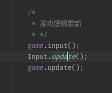

## GameEngine Java 3D V2.0

### 7.新建输入类

首先定义按键的数量与鼠标的控制数量

并且建好抬起 按下 正在按下三种状态的键盘与鼠标队列

```java

public class Input {
    /*
    * 键盘与鼠标的状态数
    * */
    public static final int NUM_KEYCODES = 256;
    public static final int NUM_MOUSEBUTTONS = 5;

    /*
    * 当前 键盘按下 当前键盘值 键盘抬起的值
    * */
    private static ArrayList<Integer> currentKeys = new ArrayList<Integer>();
    private static ArrayList<Integer> downKeys = new ArrayList<Integer>();
    private static ArrayList<Integer> upKeys = new ArrayList<Integer>();
    /*
     * 当前 鼠标按下 当前鼠标值 鼠标抬起的值
     * */
    private static ArrayList<Integer> currentMouse = new ArrayList<Integer>();
    private static ArrayList<Integer> downMouse = new ArrayList<Integer>();
    private static ArrayList<Integer> upMouse = new ArrayList<Integer>();
}

```

定义键盘按下时 判断是否抬起 与 按下键盘的方法 

```java

    /*
    * 获取键盘传来的key值
    * */
    public static boolean getKey(int keyCode){
        return Keyboard.isKeyDown(keyCode);
    }
    /*
    * 获取按下键盘获得的值
    * */
    public static boolean getKeyDown(int keyCode){
        return downKeys.contains(keyCode);
    }
    /*
    * 获取抬起键盘获得的值
    * */
    public static boolean getKeyUp(int keyCode){
        return upKeys.contains(keyCode);
    }

```

鼠标同理

```java

    /*
    * 鼠标事件同理
    * */
    public static boolean getMouse(int mouseButton) {
        return Mouse.isButtonDown(mouseButton);
    }

    public static boolean getMouseDown(int mouseButton) {
        return downMouse.contains(mouseButton);
    }

    public static boolean getMouseUp(int mouseButton) {
        return upMouse.contains(mouseButton);
    }

```

再编写更新事件 对鼠标与键盘进行更新

```java

/*
    * 更新事件
    * */
    public static void update() {
        //是否正在按下鼠标 是则压入队列
        currentMouse.clear();
        for(int i = 0; i < NUM_MOUSEBUTTONS;i++){
            if(getMouse(i)){
                currentMouse.add(i);
            }
        }
        //是否按下鼠标 是则压入队列
        downMouse.clear();
        for (int i = 0;i<NUM_MOUSEBUTTONS;i++){
            if (getMouse(i) && !currentMouse.contains(i)){
                downMouse.add(i);
            }
        }
        //是否已经抬起鼠标 是则压入队列
        upMouse.clear();
        for (int i=0;i<NUM_MOUSEBUTTONS;i++){
            if(!getMouse(i) && currentMouse.contains(i)){
                upMouse.add(i);
            }
        }
        //键盘功能同理
        upKeys.clear();

        for(int i = 0; i < NUM_KEYCODES; i++)
            if(!getKey(i) && currentKeys.contains(i))
                upKeys.add(i);

        downKeys.clear();

        for(int i = 0; i < NUM_KEYCODES; i++)
            if(getKey(i) && !currentKeys.contains(i))
                downKeys.add(i);

        currentKeys.clear();

        for(int i = 0; i < NUM_KEYCODES; i++)
            if(getKey(i))
                currentKeys.add(i);


    }

```

既然我们已经建好了Input类 那么就可以为
Game的接口里加入input
```java
public interface CyberGame {

    /*
     * 开始
     * */

    void start();

    /*
     * 更新
     * */
    void update();

    /*
     * 渲染
     * */
    void render();

    /*
    * 输入
    * */
    void input();

}


```

在类里写入测试


```java


    /*
    * 输入事件
    * */

    public void input(){
        if(Input.getKeyDown(Keyboard.KEY_UP))
            System.out.println("Up键已经被按下");
        if (Input.getKeyUp(Keyboard.KEY_UP)){
            System.out.println("Up建已经被抬起");
        }
        if(Input.getMouseDown(1)) {
            System.out.println("右键被按下");
        }
        if(Input.getMouseUp(1)){
            System.out.println("右键被抬起");
        }
    }

```
在入口类更新逻辑




结果：

### 后面可以换成这样

```java


public class Input {
    /*
    * 键盘与鼠标的状态数
    * */
    public static final int NUM_KEYCODES = 256;
    public static final int NUM_MOUSEBUTTONS = 5;

    /*
    * 上次的按键与鼠标
    * */
    private static ArrayList<Integer> lastKeys = new ArrayList<Integer>();
    private static ArrayList<Integer> lastMouse = new ArrayList<Integer>();


    public static void update(){
        lastKeys.clear();

        for(int i = 0; i < NUM_KEYCODES; i++)
            if(getKey(i))
                lastKeys.add(i);

        lastMouse.clear();

        for(int i = 0; i < NUM_MOUSEBUTTONS; i++)
            if(getMouse(i))
                lastMouse.add(i);
    }
    /*
    * 创建键盘与鼠标的抬起与按下的判断
    * */
    public static boolean getKey(int keyCode)
    {
        return Keyboard.isKeyDown(keyCode);
    }

    public static boolean getKeyDown(int keyCode)
    {
        return getKey(keyCode) && !lastKeys.contains(keyCode);
    }

    public static boolean getKeyUp(int keyCode)
    {
        return !getKey(keyCode) && lastKeys.contains(keyCode);
    }

    public static boolean getMouse(int mouseButton)
    {
        return Mouse.isButtonDown(mouseButton);
    }

    public static boolean getMouseDown(int mouseButton)
    {
        return getMouse(mouseButton) && !lastMouse.contains(mouseButton);
    }

    public static boolean getMouseUp(int mouseButton)
    {
        return !getMouse(mouseButton) && lastMouse.contains(mouseButton);
    }
    /*
    * 获取鼠标当前位置
    * */
    public static Vector2f getMousePosition()
    {
        return new Vector2f(Mouse.getX(), Mouse.getY());
    }


}

```


