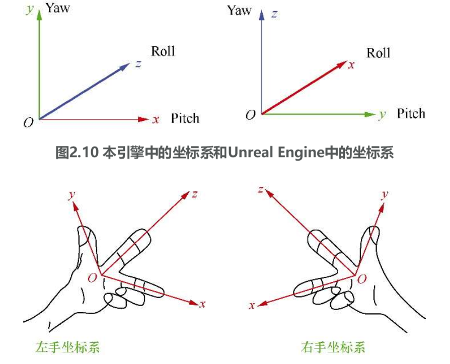
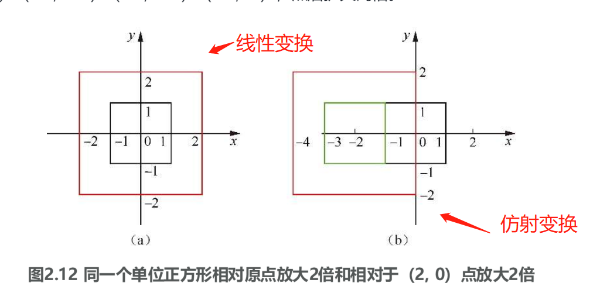
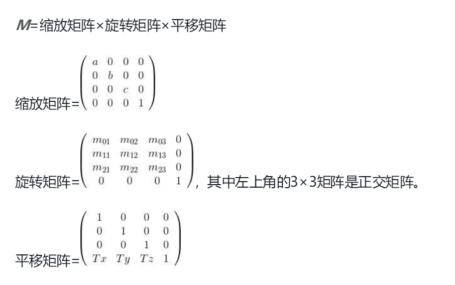

## 空间变换

3D坐标系是由一个点和3个正交的方向组成的。也就是说，这个坐标系下任何一个点v都可以由3条正交的轴向表示（向量与基向量）

一般用大拇指指向y轴，大部分引擎也是y轴向上。当然，也有z轴向上的

1.线性变换

F(a+b)=F(a)+F(b)，并且F(ka)=kF(a)，其中，a、b是变量，k是常量，F是函数。

比如，函数F(x)=3x，因为它满足F(a+b)=3(a+b)=3a+3b=F(a)+F(b)，同理F(2a)=3×2a=2F(a)

无论什么样的线性变换，都是相对于当前坐标原点来说的

(1)缩放变换

缩放变换满足以下关系式。F(x,y,z)=ax+by+cz，简单地说，就是把一个点或者一个向量v(x,y,z)的每个分量乘以一个比例系数

(2)旋转变换

F(a)=aM，a是变量，F是函数。在3D空间中，M是一个3×3的旋转矩阵，也就是说，如果它满足单位正交化，就满足线性变换

在旋转变换中，最常用的就是绕x轴、y轴、z轴旋转或者欧拉角旋转，还有一个是绕某个方向旋转，其实它们之间是可以互相转换的。也就是说，绕某个方向的旋转可以用绕x轴、y轴、z轴的旋转来完成。

因此：一定要规定好自己的欧拉角和x轴、y轴、z轴向的关系，本书中的引擎里面用欧拉角构造矩阵的顺序是Roll→Pitch→Yaw（即z轴→x轴→y轴），不同的旋转顺序得到的结果会不同

还要规定好正角度:

正角度的旋转表示顺着轴向看是逆时针的，也就是逆着轴向看是顺时针的

2.仿射变换

仿射变换是指线性变换后接着平移，也就是说，F(a)=Ma+T，其中T表示平移

在3D空间中的大部分变换是仿射变换，当然，也有非仿射变换，比如投影变换、法线的切空间变换。无论是先平移再缩放后旋转，还是先旋转再缩放后平移，**最后都可以转化成先缩放再旋转后平移**

**F(a)=aSM+T**，其中S表示缩放，M表示旋转，T表示平移

比如，如果先平移再缩放后旋转，则有F(a)=(a+T)SM=aSM+TSM，其中S表示缩放，M表示旋转，TSM表示新的平移

定义一个标准的顺序进行3D空间的仿射变换很重要，基本上所有的引擎采用**先缩放再旋转后平移**的顺序

仿射变换不一定用矩阵表示，完全可以用3D向量S表示缩放，四元数表示旋转，3D向量表示平移。但矩阵可以整合缩放、旋转和平移，这样进行空间变换要方便很多。

3.缩放矩阵 旋转矩阵 平移矩阵

4.空间变换在游戏引擎里

一般情况下，**骨架层级用矩阵表示，而动作数据用3D向量表示缩放和平移，用四元数表示旋转，在计算GPU蒙皮的时候再转换成矩阵**

矩阵和向量左乘还是右乘的问题。每个引擎都有自己的规定。本书讲的都是左乘，也就是说，矩阵始终在向量右面，比如，对于一个顶点v，使用矩阵变换v′=vM

一般使用引擎理解仿射变换就足够了，但如果写引擎还要理解很多复杂的变换，除了正交和透视变换之外，计算阴影也会用到这种复杂变换

拓展阅读

《3D数字基础：图形与游戏开发》